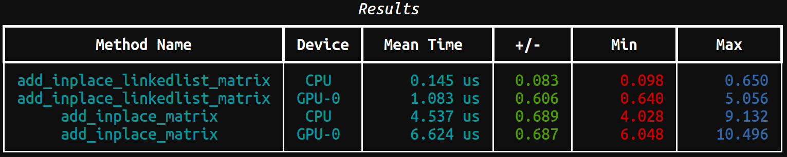

For university.

## 1

[Link List Method](matrix_linkedlist_inplace_operation_method.py)

$\forall A \in X, n(P(A, ⊕) - P(U(A), ⊕)) - T(A) > 0 \implies$ The matrix should be converted to a linked list for $n$ operations.

## 2

## 3