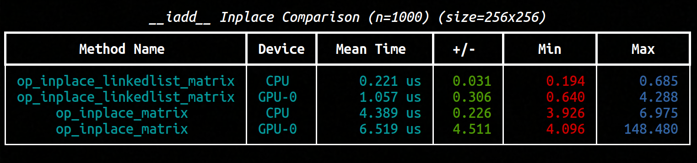
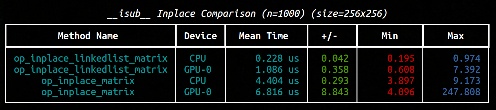
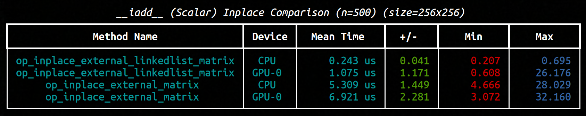
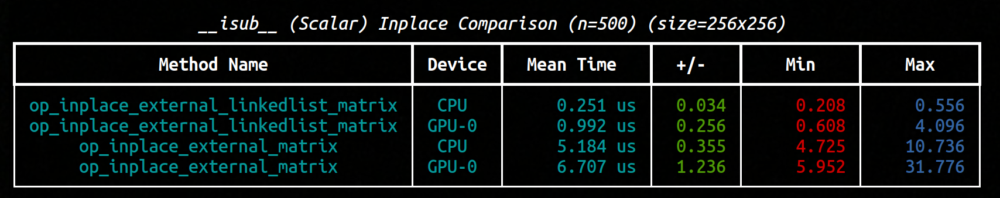
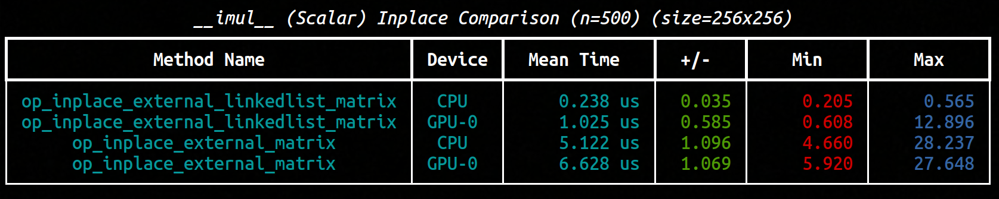
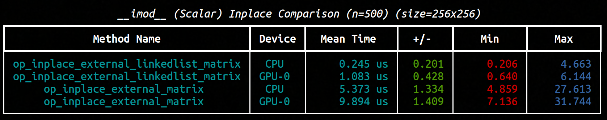
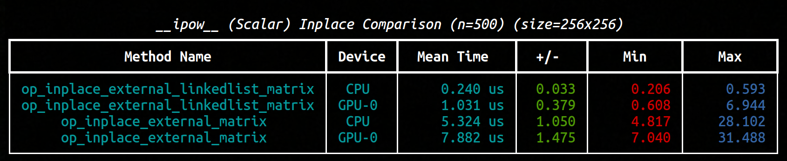
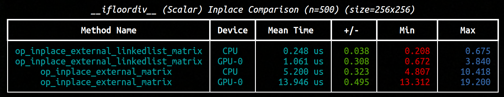

For university.

# Preview

- [Preview](#preview)
- [Conjecture 1 - Linked List Matrices](#conjecture-1---linked-list-matrices)
  - [Inplace Field Operations Comparisons](#inplace-field-operations-comparisons)
    - [`addition`](#addition)
    - [`subtraction`](#subtraction)
    - [`multiplication`](#multiplication)
  - [Inplace Scalar Operations Comparisons](#inplace-scalar-operations-comparisons)
    - [`addition`](#addition-1)
    - [`subtraction`](#subtraction-1)
    - [`multiplication`](#multiplication-1)
    - [`mod`](#mod)
    - [`power`](#power)
    - [`floordiv`](#floordiv)
- [Conjecture 2 - Scalar dtype Conversion Decorators](#conjecture-2---scalar-dtype-conversion-decorators)
- [Conjecture 3](#conjecture-3)

# Conjecture 1 - Linked List Matrices

[Conjecture](./conjecture.md)

$\forall A \in X, n(P(A, ⊕) - P(U(A), ⊕)) - T(A) > 0 \implies$ The matrix should be converted to a linked list for $n$ operations.

## Inplace Field Operations Comparisons

[Linked List Matrix - Closed Inplace Operations](./structures/linked_list_matrix.py)

### `addition`

> 

>
> 
&nbsp; Click to Expand

>
> #### integer
>
> 
>
> #### float16
>
> #### float32
>
> 

> 

---

### `subtraction`

> 

> 
> 
&nbsp; Click to Expand

>
> 
> #### integer
>
> 
>
> #### float16
> 
> #### float32
> 
> 

> 

---

### `multiplication`

> 

>
> 
&nbsp; Click to Expand

>
> #### integer
>
> #### float16
>
> #### float32
>
> 

> 

## Inplace Scalar Operations Comparisons

### `addition`

> 

>
> 
&nbsp; Click to Expand

>
> #### integer
>
> 
>
> #### float16
>
> #### float32
>
> 

---

### `subtraction`

> 

>
> 
&nbsp; Click to Expand

>
> #### integer
>
> 
>
> #### float16
>
> #### float32
>
> 

---

### `multiplication`

> 

>
> 
&nbsp; Click to Expand

>
> #### integer
>
> 
>
> #### float16
>
> #### float32
>
> 

---

### `mod`

> 

>
> 
&nbsp; Click to Expand

>
> #### integer
>
> 
>
> #### float16
>
> #### float32
>
> 

---

### `power`

> 

>
> 
&nbsp; Click to Expand

>
> #### integer
>
> 
>
> #### float16
>
> #### float32
>
> 

---

### `floordiv`

> 

>
> 
&nbsp; Click to Expand

>
> #### integer
>
> 
>
> #### float16
>
> #### float32
>
> 

---

&nbsp;

# Conjecture 2 - Scalar dtype Conversion Decorators

&nbsp;

# Conjecture 3